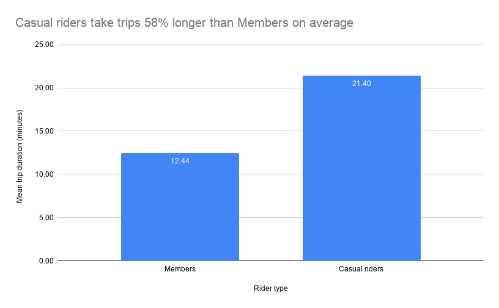
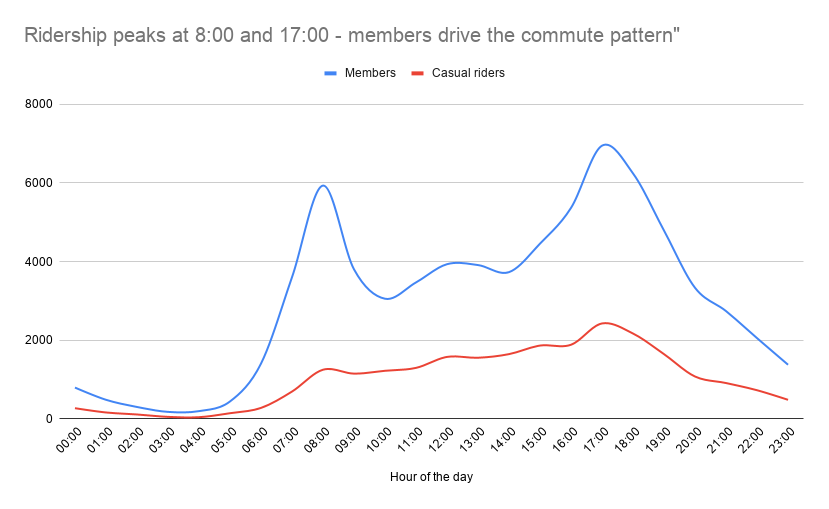
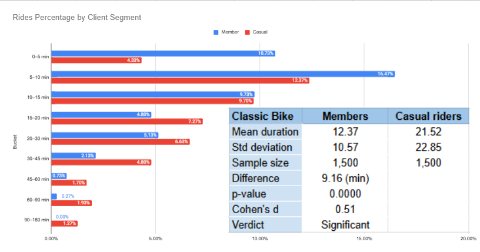

# Capital Bikeshare Data Pipeline
### A Google Sheets pipeline built on September 2023 trip data

---

## What This Project Is

A complete data pipeline built entirely in Google Sheets, taking raw Capital Bikeshare 
trip data from ingestion through cleaning, aggregation, statistical analysis, probability 
modelling, and A/B testing - ending in a business-ready dashboard.

**One-sentence story:**  
"Members and casual riders use the bikeshare system in fundamentally different ways, and an A/B test reveals that client type drives real 
differences in trip length."

---

## The Pipeline Architecture

| Tab | Layer | What it does |
|-----|-------|--------------|
| `00_RAW` | Ingestion | Untouched CSV import — never modified |
| `01_SCHEMA` | Documentation | Column definitions, data types, quality notes |
| `02_CLEAN` | Transformation | Derived columns, `is_valid` flag, cleaning summary |
| `03_AGGREGATE` | Aggregation | Summary metrics — the "fact table" for downstream tabs |
| `04_STATS` | Analysis | Five-number summary, distribution shape, CoV |
| `05_PROBABILITY` | Analysis | Empirical probabilities, independence test, joint distribution |
| `06_SAMPLING` | Experiment prep | Random 3,000-row extract (1,500 per group) by bike type |
| `06.1_SAMPLING` | Experiment prep | Random 3,000-row extract (1,500 per group) by customer type |
| `07_AB_TEST` | Experiment | Welch's t-test, p-value, Cohen's d, confound check by bike type  |
| `07.1_AB_TEST` | Experiment | Welch's t-test, p-value, Cohen's d, confound check by customer type |
| `08_DASHBOARD` | Output | One-screen summary referencing all upstream tabs |

---

## Key Findings

- **Total valid trips (September 2023):** 97,044
- **Data quality pass rate:** 97.4 %
- **Members vs casual split:** 74.7 % members / 25.3 % casual
- **Mean trip duration - members:** 12.4 min · **casual:** 21.4 min
- **Most popular hour:** [5 PM]
- **A/B test result (classic vs electric):** p = 5.674 · Cohen's d = 0.07 · Significant
- **A/B test result (member vs casual):** p = 0.000 · Cohen's d = 0.51 · Significant

---

## The A/B Test (classic vs electric)

**Hypothesis:** Electric bike riders take longer trips than classic bike riders.

**Method:** Welch's two-sample t-test (α = 0.05) on a random sample of 1,500 classic 
and 1,500 electric bike trips drawn from valid September 2023 records.

**Result:** If there were truly no difference between classic and electric bike trip durations, 
we would see a difference larger by chance 5.67% of the time. Therefore, we FAIL TO REJECT 
Hypothesis₀.The difference is statistically significant at α >= 0.05. Cohen's d Large  0.07: Real but minor.
Confound check do not show us a huge diference between types of the bike.

## The A/B Test (member vs casual)

**Hypothesis:** There is NO difference in mean trip duration between member and casual bike riders.

**Method:** Welch's two-sample t-test (α = 0.05) on a random sample of 1,500 member 
and 1,500 casual rider bike trips drawn from valid September 2023 records.

**Result:** If there were truly no difference between member and casual trip durations, we would see 
a difference less than 0.01 % of the time. Therefore, we REJECT Hypothesis₀.The difference is statistically 
significant at α >= 0.05. Cohen's d Large 0.51 is Large, Not conclusive. Confound check show us a huge 
diference between types of customer.

---

## Visuals

Casual riders average 21.4 minutes per trip versus 12.4 minutes for Members.
This suggests the system serves two fundamentally different populations - commuters
who need short, reliable rides and leisure riders who are exploring the city.

Trip volume spikes at 8:00 and 17:00, following the pattern of a typical office commute.
In time between this two peak hours we can see lower quantity of usage by Casual rider so we can ajust our price policy.

The effect is real but not dramatic: a Cohen's d of 0.51 means the two groups overlap substantially, and the confound check 
confirms bike type doesn't explain the gap (classic: 12.3 vs 22.3 min; electric: 12.5 vs 17.7 min  the member-casual split 
persists across both).The 12.4% of casual users already riding under 15 minutes are the easiest conversion target for membership 
growth.

---

## Tools Used

- **Google Sheets** - entire pipeline built here (no Python, no SQL, no external tools)
- **Canva** - insight card design and chart polish
- **GitHub** - version control and portfolio publication

---

## Data Source

Capital Bikeshare System Data - September 2023  
Available at: [capitalbikeshare.com/system-data](https://capitalbikeshare.com/system-data)  
Raw data not included in this repo. Download the file `202309-capitalbikeshare-tripdata.csv` 
from the source link and import into `00_RAW` to reproduce this pipeline.

---

## What I Learned

  The most unexpected finding was how clearly structured documentation reduced the barrier to understanding for a non-technical audience. Each stage of the pipeline had an explicit output and a documented decision and that made it possible to present the entire project as a logical sequence rather than a collection of spreadsheet tabs. Good documentation, it turns out, is not just an internal tool. It is the kind a presentation.
  
  Data cleaning and filter management in Google Sheets consumed a disproportionate share of the project timeline. What appeared to be straightforward validation. Removing blank rows, flagging duration outliers, isolating valid records in fact required constant manual coordination across tabs. The one million cell limit also forced a sampling decision that would not have been necessary in a more capable tool. Adding a methodological constraint that had to be carefully documented to remain defensible.

  What I would do differently. 
  1. Replace formulas with pivot tables and Measures. Dynamic aggregations that update automatically, with no risk of broken cell references across tabs.
  2. Switch to other programm (like Excel). The 1.3M rows per sheet means the full 450k row dataset fits without sampling. That means removing the main methodological constraint of this project.
  3. Visualise in Power BI tool. Interactive dashboards connected directly to the data source. Benefit that is no manual chart updates and fully shareable with stakeholders.
  
---

## LINKS

Portfolio page URL:  [serhiy-dranko.carrd.co](https://serhiy-dranko-portfolio.carrd.co)

GitHub repo URL:     [github.com/serhiy-dranko/capital-bikeshare-pipeline](https://github.com/serhiy-dranko/capital-bikeshare-pipeline)

Google Sheets pipeline: [docs.google.com/spreadsheets/capital_bikeshare-from_raw_data_to_A/B_test_decision](https://docs.google.com/spreadsheets/d/1GTRWs7EQf-0B6a5CGs0x70nKAOVCuKq1gbzI7UB1h5s/edit?usp=sharing)

---

## Pipeline Log

See [`pipeline/pipeline_log.md`](pipeline/pipeline_log.md) for a full record of 
decisions made at each stage — cleaning rules, exclusion rationale, test design choices.

